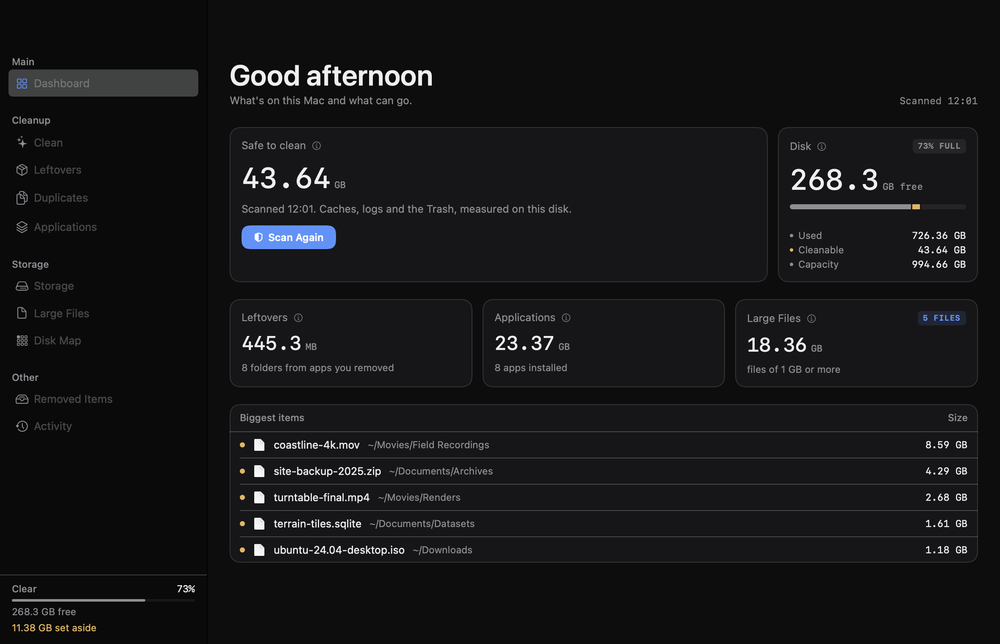
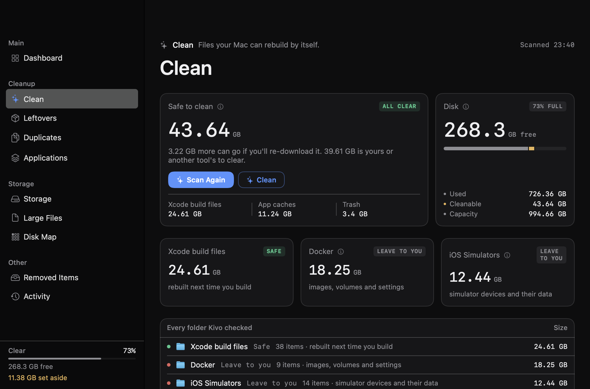
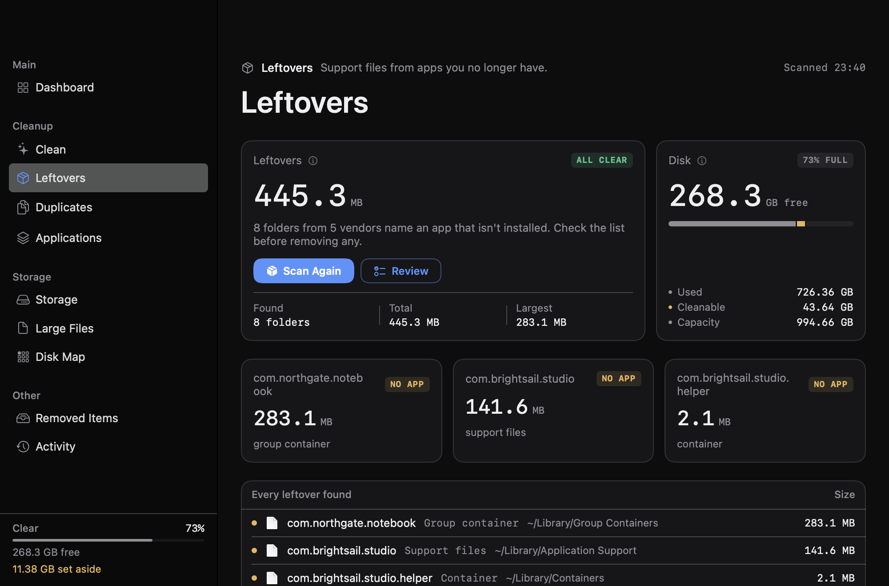
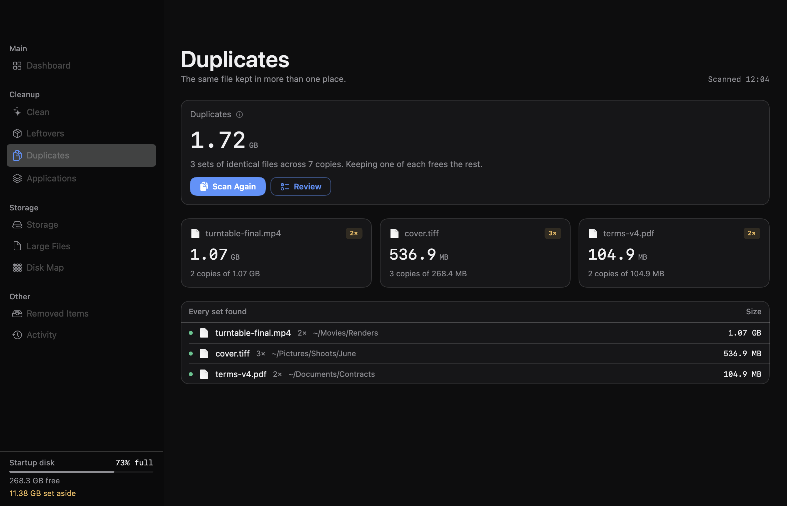
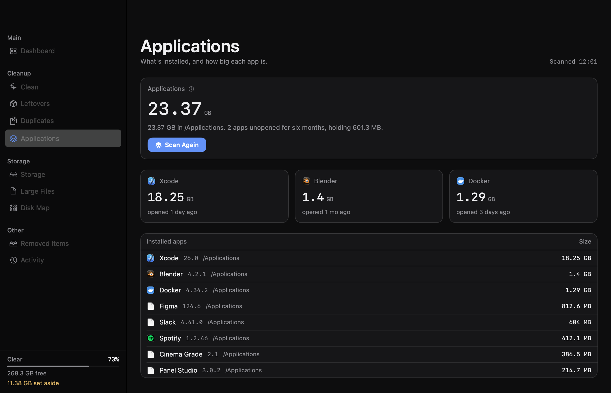

# Kivo

A disk cleaner for macOS that shows its working. Kivo measures what is on
your Mac, explains why each thing is safe to remove or isn't, and puts
everything it takes somewhere you can get it back from.



## What it does

**Clean** measures the folders a Mac rebuilds by itself — caches, logs, the
Trash, Xcode's derived data, npm and pnpm stores, simulator devices, Docker's
data — and sorts them into what is safe to remove, what comes back at the
cost of a download, and what Kivo will not touch. Downloads is measured and
left alone. Docker and the simulators are shown with the command that
reclaims them properly, because deleting those folders by hand confuses the
tools that own them.



**Leftovers** finds support files whose app is gone, grouped by the vendor
that left them, so one app with forty widgets is one row rather than forty.



**Duplicates** compares files by content, not by name: a size match, then a
64 KB head hash, then a full SHA-256, with hard links recognised as one file
rather than a copy of themselves.



**Applications** lists what is installed with its version, size and last
use, and uninstalls one with everything it scattered around your Library.



**Storage, Large Files and Disk Map** answer the other question: not what
can go, but where it all went. The map is a squarified treemap of every
folder, drawn to scale.

**Removed Items** is where everything Kivo takes goes first, with a button
to put any of it back where it came from.

## Safety

A cleaner is a program that deletes your files, so the rules are worth
stating plainly.

- **Nothing is deleted outright.** Removals go to the Trash or to Kivo's own
  holding area, and anything held can be restored to its exact original
  path. Permanent deletion is a separate, deliberate action.
- **Nothing is guessed at and then swept.** The Leftovers list arrives with
  nothing ticked, because Kivo is inferring which app a folder belonged to
  and a wrong inference is Kivo's mistake, not yours.
- **Only reverse-DNS folder names are candidates.** "Google" and "MobileSync"
  are skipped: there is no honest way to decide who owns them. Apple's own
  identifiers are never candidates at all.
- **An installed app protects its files**, including the helpers, widgets,
  extensions and group containers named after it, and including apps that
  live in a folder inside /Applications or are running from somewhere else
  entirely.
- **Every path is checked before removal** against a guard that refuses
  anything outside the home folder's known locations.
- **The rules have tests.** The suite is mostly about what Kivo must not do.

## Install

Download the latest `Kivo.zip` from
[Releases](https://github.com/NickCEllis/kivo/releases), unzip it, and drag
Kivo to your Applications folder.

The first launch is blocked, because the app carries no distribution
certificate: it is signed ad-hoc, which means macOS can confirm nobody has
tampered with it but cannot say who made it. macOS will say it cannot verify
the developer. To open it anyway: **System Settings → Privacy & Security**,
scroll to the message about Kivo, press **Open Anyway**, then confirm. On
macOS 14 you can instead right-click the app and choose Open.

Kivo then asks for **Full Disk Access**, which it needs to measure folders
macOS protects, and which no app can grant itself: **System Settings →
Privacy & Security → Full Disk Access**, then add Kivo. Without it Kivo
still runs, and says which figures are incomplete.

If you would rather not run a build you did not make, build it yourself —
it takes one command.

## Build it yourself

Requires Xcode 16 or later and macOS 14 or later.

```bash
git clone https://github.com/NickCEllis/kivo.git
cd kivo
xcodebuild -scheme Kivo -configuration Release -derivedDataPath build build
cp -R build/Build/Products/Release/Kivo.app /Applications/
```

Or open `kivo.xcodeproj` and press ⌘R.

Signing uses your own team, so set one in Xcode (Signing & Capabilities) the
first time. The App Sandbox is deliberately off: a sandboxed process cannot
read `~/Library/Caches`, `~/.Trash` or `/Applications`, so every figure Kivo
shows would be zero.

## Tests

```bash
xcodebuild test -scheme Kivo -destination 'platform=macOS'
```

They run against temporary directories, never your real home folder — every
piece of code that touches the file system takes the home folder as a
parameter, which is the fix for an early version that cleaned the author's
actual caches while under test.

## How it is put together

- `kivo/Core` — everything that measures or moves a file, with no SwiftUI in
  it. `SystemScanner`, `SystemCleaner`, `OrphanFinder`, `DuplicateFinder`,
  `AppUninstaller`, `Quarantine`, `TreemapLayout`, and `ScanStore`, the one
  observable object the interface reads.
- `kivo/UI` — the window, the pages and the review sheets. `KivoTheme` holds
  every colour, size and font in the app.
- `kivoTests` — Swift Testing, mostly about the rules above.
- `Tools` — `render-icon.sh` draws the app icon from code, `shoot.sh`
  refreshes the screenshots in this README.

The screenshots are taken from invented data (`DemoData.swift`, Debug only),
not from anybody's real disk.

## License

See [LICENSE](LICENSE). Short version: use it, read it, change it. If you
fork it or hand it on, keep the notice and credit the project with a link.
It is not an OSI-approved open-source license.
